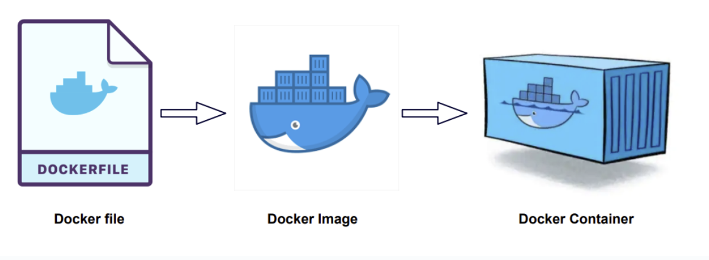

# DOCKER

# 虚拟机

虚拟机是模仿电脑硬件的软件，相当于一台装在电脑里的电脑，它有自己的操作系统，内存，磁盘空间。

虚拟机之间互不影响，可以运行不同的操作系统，可以在虚拟机中随机装软件而不用担心搞坏主系统。


# Docker

开发、测试和运维团队在各自的环境中工作时，通常会遇到开发环境不一致的问题，搭建环境是一项很费时费力的工作，虽然虚拟机可以直接clone一份环境给其他阶段的人员，但是虚拟机本质上是一台电脑，而每台电脑都需要操作系统，操作系统的存在会占用大量内存同时启动会比较缓慢，对于部署应用程序的需求使用虚拟机过于浪费。

因此出现了容器技术，容器技术通过linux实现了每个容器之间的隔离，容器在宿主机的操作系统上运行，共享宿主机的内核和操作系统，容器只会打包应用以及其依赖项，不会打包整个操作系统，记住宿主机的操作系统的虚化技术提供所需的操作系统环境。相比于虚拟机容器更快更小，性能更好。


docker是使用了容器技术的体现


docker中有镜像和容器

+ 镜像：一个只读的模板，里面包含了运行某个程序或服务所需的所有内容
+ 容器：镜像的运行实例，运行起来的环境


Dockerfile是一个文本文件，包含了一系列指令，用于构建Docker镜像




# Dockerfile

指定基础镜像 即新镜像基于谁来构建 

```dockerfile
FROM python:3.11.8-alpine、
```


python镜像有三种

| 镜像标签             | 体积大小（大概） | 特点                   |
| -------------------- | ---------------- | ---------------------- |
| `python:3.11`        | 900MB 左右       | 完整构建工具、调试支持 |
| `python:3.11-slim`   | 250MB 左右       | 去掉文档和编译工具     |
| `python:3.11-alpine` | 50MB 左右        | 极小，但可能依赖缺失多 |


设置环境变量

```python
ENV FLASK_APP=run.py
ENV FLASK_CONFIG=docker
```


一般不以root身份执行保证安全性，因此要创建新用户

```python
# python:3.11-alpine下
RUN adduser -D flasky

# python:3.11-slim下
RUN adduser --disabled-password --gecos "" flasky
```


接下来用户操作都以flasky用户身份执行

```python
USER flasky
```


设置容器内的工作目录，后续的所有指令(RUN CMD COPY都会基于这个文件工作)，该目录位于DOCKER容器内部的虚拟文件系统

```python
WORKDIR /app
```


COPY [源目录/文件] [目标位置]

```python
COPY requirements requirements

COPY app app 
COPY migrations migrations
# 复制多个到当前目录下
COPY run.py config.py boot.sh ./
```


RUN是构建镜像时执行的命令

```python
RUN python -m venv venv
RUN venv/bin/pip install -r requirements/docker.txt
```


声明要监听的端口

```python
EXPOSE 5000
```


建立容器时运行的脚本或命令

```python
# 容器启动时要运行的脚本
ENTRYPOINT [ "./boot.sh" ]

# 指定容器启动时的默认命令 可以设定参数
CMD ["python", "main.py"]
```


# 初始化

构建docker镜像，-t 镜像名字 . 在当前目录下寻找dockfile文件

```python
docker build -t 'testflask' .
```

想要更新镜像就要重新构建，重新构建会基于已有的镜像构建，速度较快


查看已有或已拉取的镜像

```python
docker images ls
```


# 推送

首先登录，似乎因为本地下载了docker desktop 直接就登上了

```python
docker login
```


对要推送的镜像要打一个标签

```dockerfile
docker tag 镜像名 nndjxh(docker hub用户名)/flask_web(子目录，也可以不加)/flask(本地镜像)
```


最后推送

```python
docker push nndjxh/flask_web/flask	
```


# 运行


```python
docker run --name flasky -d -p 8000:5000 \
 -e SECRET_KEY=57d40f677aff4d8d96df97223c74d217 \
 -e MAIL_USERNAME=<your-gmail-username> \
 -e MAIL_PASSWORD=<your-gmail-password> flasky:latest
```

+ --name 设置容器的名称
+ -d 设置后台运行
+ -p 设置端口映射，将运行机器的8000端口映射到5000，flask应用一般监听5000端口
+ -e设置环境变量

执行命令后终端会输出容器的ID，根据该ID可以停止容器

```python
docker stop 71357ee776ae
```


删除容器

```python
docker rm 71357ee776ae
```


停止并删除

```python
 docker rm -f 71357ee776ae
```


查看当前正在运行的容器

```python
docker ps
```


进入容器内部，container_name_or_id通过docker ps 查看

```python
docker exec -it <container_name_or_id> bash
```

容器没有安装 `bash`，你可以使用 `sh`

```python
docker exec -it <container_name_or_id> sh
```


# 编排

 docker-compose用于一次性启动多个容器，注意这是一项命令而不是将多个镜像整合为一个，需要拉取镜像后自行设置。


应用依赖于多个容器，可以使用docker-compose**一次性启动**，在根目录下配置docker-compose.yml文件

```python
services:
  flasky:
    build: .
    ports:
      - "8000:5000"
    env_file: .env
    depends_on:
      - dbserver
    restart: always
  
  dbserver:
    image: "mysql:latest"
    env_file: .env_mysql
    restart: always
```

+ services下指定服务名(容器名)
+ build . 基于当前目录向下的dockfile构建flask镜像，镜像名默认为目录名_flasky
+ image 基于的镜像的位置
+ env_file 指定环境变量的配置
+ restart: always 如果容器崩溃，那么docker总会重启它
+ depends_on 服指定服务之间的依赖关系，确保启动顺序


```python
docker-compose up --build
```

+ --build会强制在启动容器之前构建build指定的镜像，保证了flask项目的更改生效


